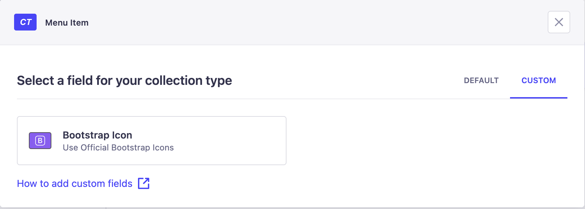
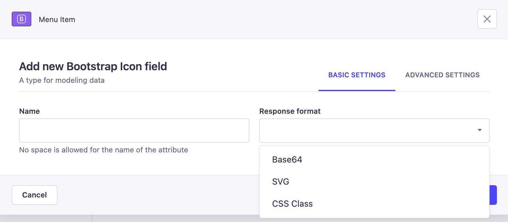
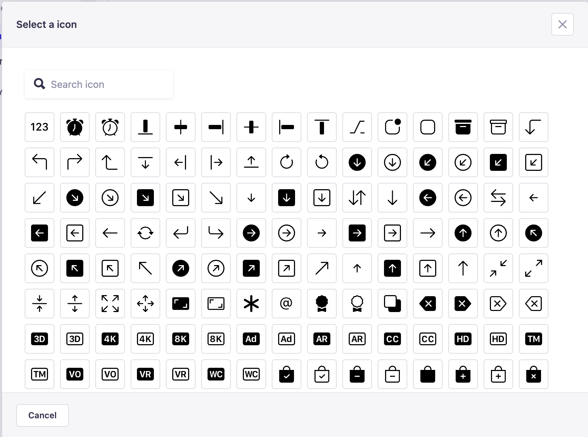
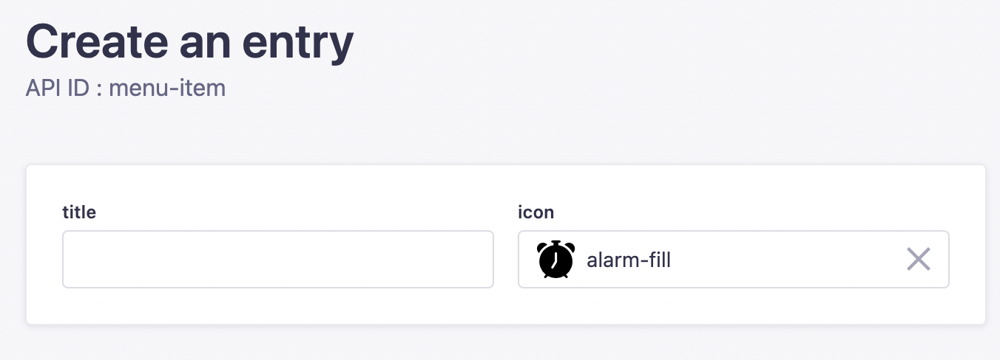

<p align="center">
     
</p>

<h1 align="center">
  Bootstrap Icons for Strapi
</h1>

<p align="center">Plugin for adding bootstrap icons to <a href="https://strapi.io/" target="_blank">Strapi</a>.</p>

<p align="center">
  <a href="https://www.npmjs.com/package/strapi-bootstrap-icons">
    
    
  </a>
</p>

Strapi Bootstrap Icons Plugin is a custom plugin for Strapi that allows to use [Bootstrap Icons](https://icons.getbootstrap.com/) for your content. 

## Installation

To install the Strapi Bootstrap Icons, simply run one of the following command:

```
npm install strapi-bootstrap-icons
```
```
yarn add strapi-bootstrap-icons
```

## Setup

After installation you will find the `Bootstrap Icon` at the custom fields section of the content-type builder.



Now you can define the field attributes. Advanced UUID field allows you to select a response type for the field value in 3 formats.

- Base64
- SVG
- CSS Class



Now You can create new records via the Admin panel with selecting your preferred bootstrap icons.







## License
This plugin is licensed under the MIT License. See the LICENSE file for more information.